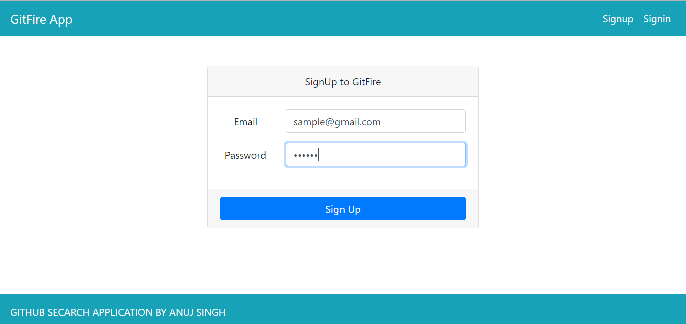
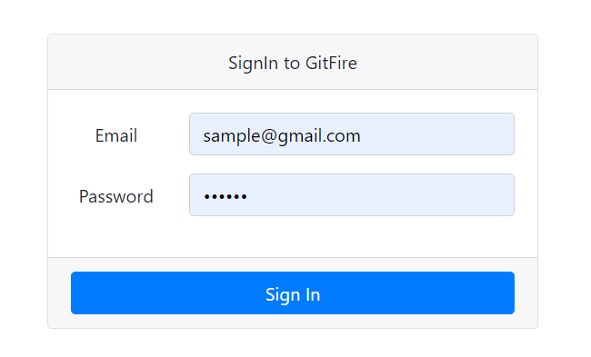
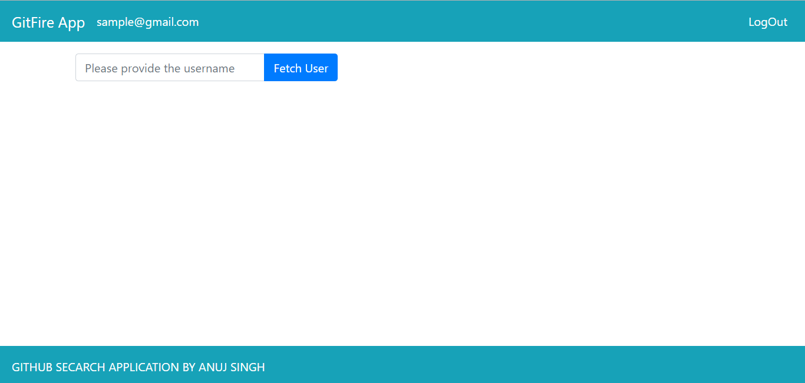

# GitFire - React Application which uses firebase and github official API


### Features : 

1. User signup and signin using Firebase
2. Github profile and it's repo search using it's official API

### Screenshots : 






# Note :

Inside **src/config/FirebaseConfig.js**, use your own firebase credientials.

```
export default {
    apiKey: "",
    authDomain: "",
    databaseURL: "",
    projectId: "",
    storageBucket: "",
    messagingSenderId: "",
    appId: "",
    measurementId: ""
  }
  ```


## Available Scripts

In the project directory, you can run:

### `npm start`

Runs the app in the development mode.<br />
Open [http://localhost:3000](http://localhost:3000) to view it in the browser.

The page will reload if you make edits.<br />
You will also see any lint errors in the console.
